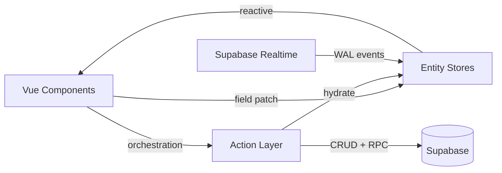
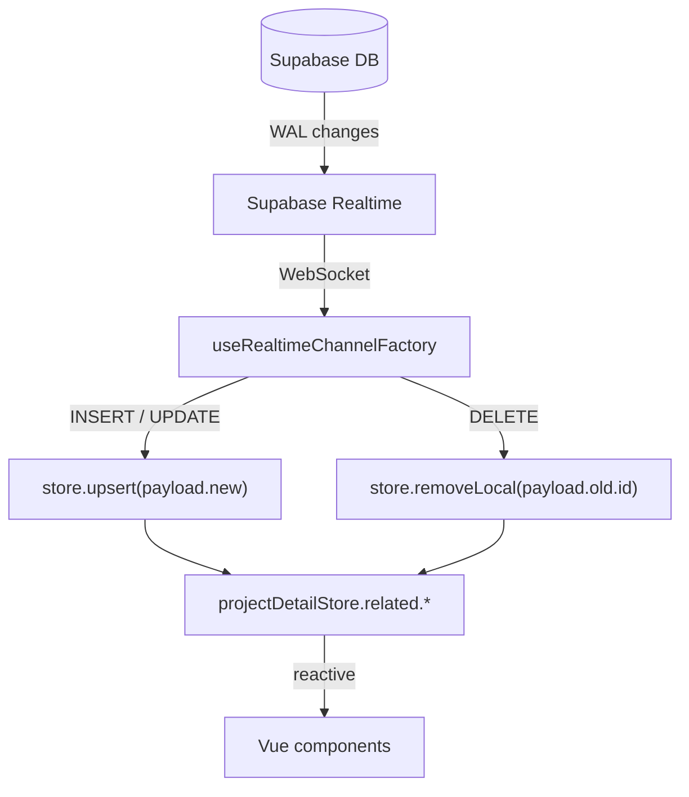

# Arcus — Project Draft

> Preview file. Approve this, then I'll write to the seed files.

## Name / Slug / Year / Company / Repo

- **Name:** Arcus
- **Slug:** arcus
- **Year:** 2025
- **Company:** none (personal project)
- **Repo URL:** https://github.com/schir2/arcus
- **Project URL:** https://getarcus.com
- **is_public:** true

## Summary

Asana alternative I built from scratch, with real-time multi-user collaboration and a custom Pinia store architecture rebuilt once the original approach could not keep up.

## Description (Markdown)

Arcus is a project and task management app I built after getting tired of paying for Asana. I needed something to organize my own website builds that worked the same way Asana did. What started as a side idea grew into a full platform with real-time collaboration, a Vue Flow dependency diagram, and a custom state management architecture I rebuilt from scratch when the original design slowed down on complex projects.

The app is live at [getarcus.com](https://getarcus.com). It is not widely advertised yet -- a small group of early users has access while I finish the current architectural refactor and validate the data migration. Core task management works: projects with customizable statuses and priorities, tracks that organize work by domain or responsibility (each with a default assignee so tasks inherit ownership on creation), tasks with comments, tags, due dates, and a visual dependency graph built with Vue Flow.

### Architecture

The most interesting engineering problem was state management under real-time conditions. When multiple users edit a project simultaneously, 13 Supabase Realtime channels stream Postgres WAL events directly to the client. A channel factory applies inserts, updates, and deletes to the matching store without a round-trip to the server.

After the original architecture proved too slow on complex projects, I rebuilt it around a three-layer model:

- **Stores** hold state only. They do not fetch data or call RPCs. A `createObjectStore` factory generates uniform store instances keyed by Supabase table name.
- **Actions** own all orchestration: API calls, multi-store coordination, error handling, and toast notifications. An `useAction` wrapper gives every action its own `isLoading` and `error` state so components get accurate per-button spinners.
- **Components** call stores directly for single-field patches and emit events upward only when an operation needs service-layer logic (creating a track, confirming a deletion).

This is documented in `docs/adr/` if you want to dig into the reasoning.

### Realtime pipeline

All realtime tables have `REPLICA IDENTITY FULL` set so DELETE events carry the full row and the `project_id` column filter can match them correctly. Without this, Postgres only writes the primary key to the WAL on DELETE and the Supabase Realtime server silently drops the event.

### What I planned but have not built yet

Two features I wanted to add but have not gotten to.

The first is democratic task prioritization. In team settings, traditional priority levels break down when everything is urgent. The idea: give each team member a limited pool of votes to allocate across project tasks. Scarcity forces real prioritization -- tasks surface ranked by vote weight rather than by what whoever set up the board decided. Works better than flags when you have multiple stakeholders all marking things as urgent.

The second is an AI-executable workflow template system. Tracks already model the ownership and handoff structure of a project, and the dependency diagram renders that structure visually. I wanted to add a way to define a structured sequence of task templates that an agent could instantiate and execute, using the track graph as the workflow scaffold. Claude Workflows shipped a few weeks after I had the idea, which was both validating and mildly deflating. The visual builder angle still feels like a useful layer on top.

## Skills

Nuxt, VUE, TypeScript, Tailwind, Supabase, Postgres, PrimeVue, Pinia, Zod

## New Skills to Add to DB

| Name | Icon | Proficiency | Category |
|---|---|---|---|
| PrimeVue | `simple-icons:primevue` | intermediate | Front-End Technologies |
| Pinia | `logos:pinia` | advanced | Frameworks and Libraries |
| Zod | `simple-icons:zod` | intermediate | Frameworks and Libraries |

## Featured Project

Already listed at display_order 4. Existing tagline:
> "Asana and Linear-inspired task manager built from the ground up with Nuxt, Supabase, and TypeScript."

Proposed updated tagline:
> "A personal Asana alternative with real-time multi-user collaboration and a custom store architecture built for the complexity of live collaborative editing."

That may be too long. Alternative:
> "Task manager I built from scratch with real-time collaboration, a Vue Flow dependency diagram, and a three-layer Pinia architecture."
