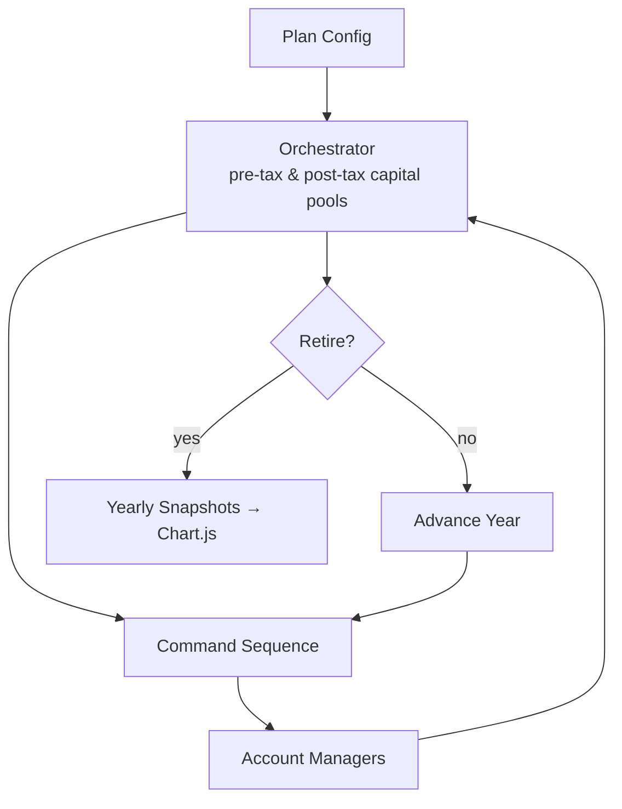
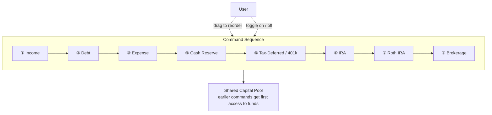
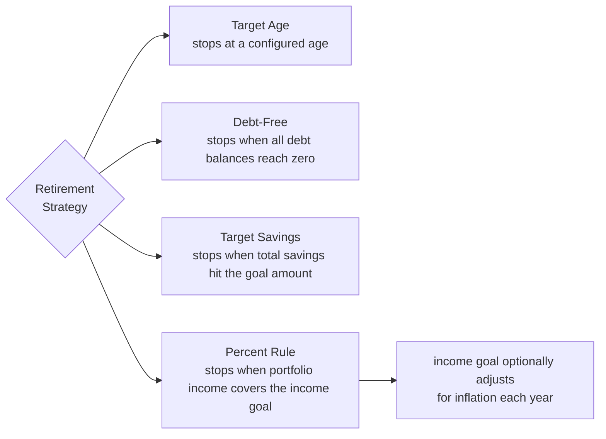
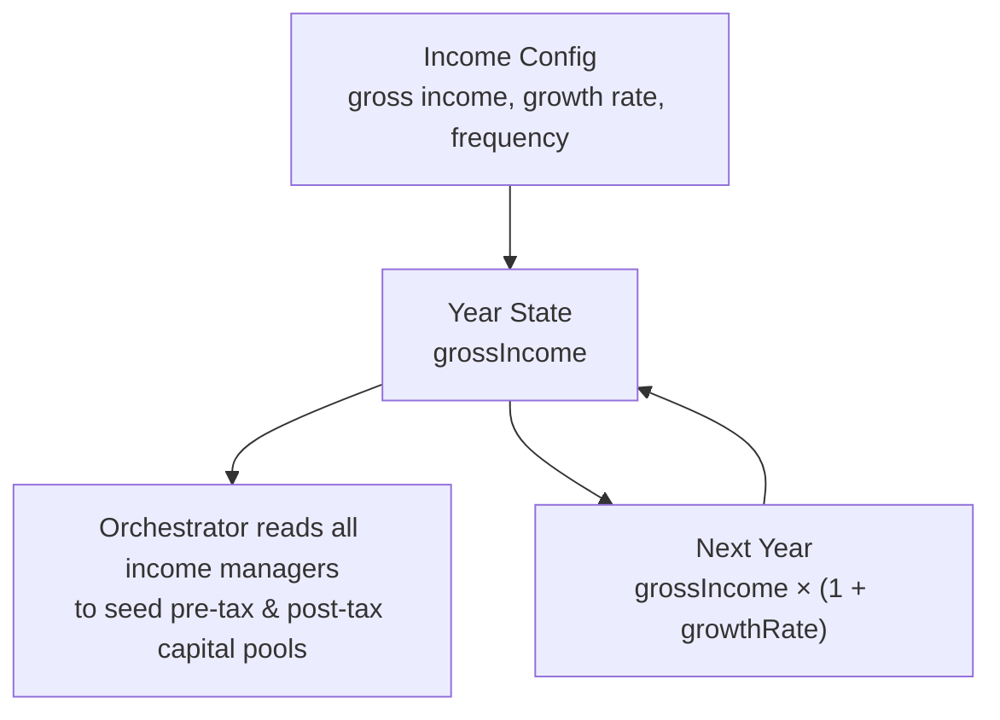
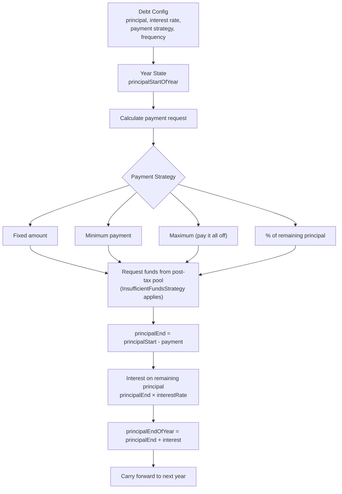
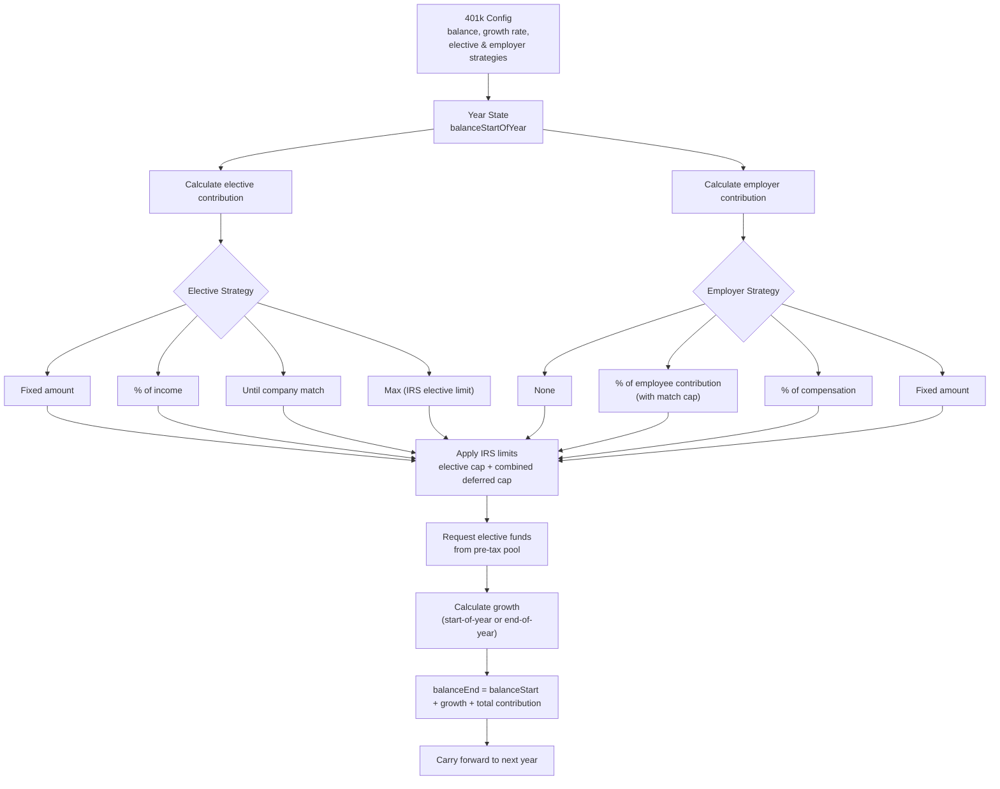
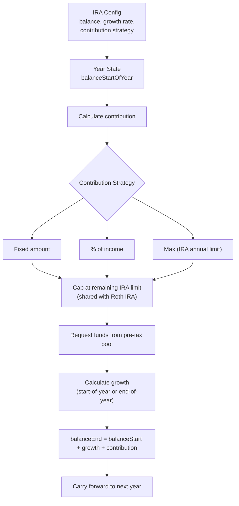
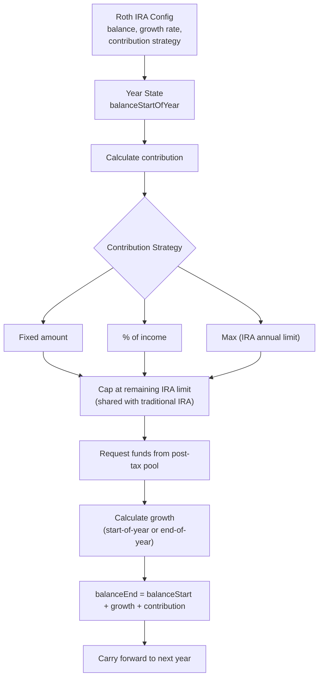
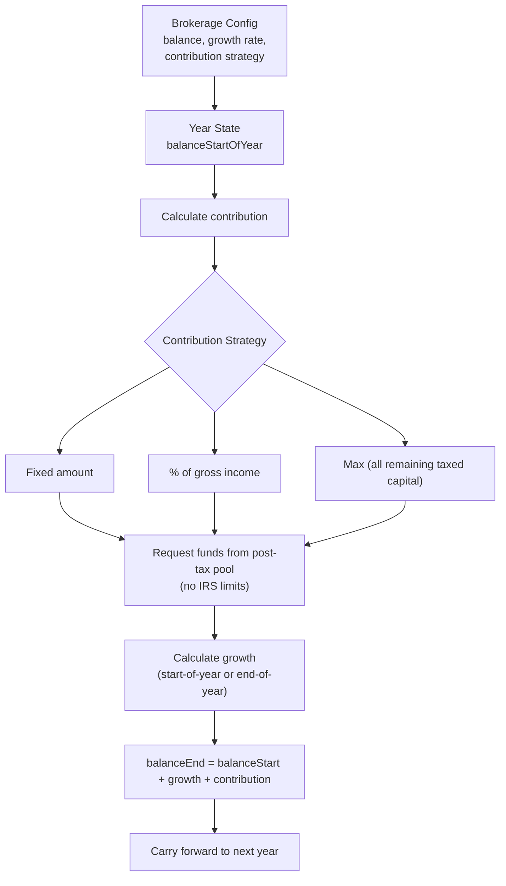

# Calcura — Project Draft

> Preview file. Approve this, then I'll write to the seed files.

## Name / Slug / Year / Company / Repo

- **Name:** Calcura
- **Slug:** calcura
- **Year:** 2024
- **Company:** none (personal project)
- **Repo URL:** https://github.com/schir2/calcura
- **Project URL:** https://calcura.org
- **is_public:** true

## Summary

Retirement scenario planner that shows how savings, spending, and investment choices compound across a working lifetime.

## Description (Markdown)

Someone near and dear to me, a CFA and CFP, had a spreadsheet she used to model when her clients could retire and thought it might make an interesting project for me to learn from. That idea opened a door. I got curious about how the math worked, then about why so few people ever get to see it. Financial literacy is largely left out of U.S. schools; the tools to understand compound growth, account trade-offs, and retirement timelines stay in the hands of people who can already afford professional advice. Calcura won't fix any of that, but it can show someone how the math actually works and maybe get them curious enough to keep going.

Calcura runs year-by-year retirement simulations across all the account types that matter: 401(k)s, traditional and Roth IRAs, taxable brokerage accounts, cash reserves, income streams, and debt schedules. Multiple plan scenarios can be saved and compared side by side, so you can see how a higher savings rate, an earlier debt payoff, or a different asset allocation shifts the picture. Results render as interactive Chart.js charts that make the compounding effect visible.

## How It Works

The simulation engine runs year by year, up to 60 years forward, stopping when a retirement condition is met. Each year, the Orchestrator dispatches a Command Sequence, collects results from all account managers, updates its capital pools, and checks whether retirement has been reached. Every account keeps an immutable snapshot of its state for that year, so the full projection history is available for charting.

### Command Sequence

Each year runs as an ordered list of Commands, one per account, executed in sequence. The order is user-configurable: accounts can be dragged into any position, toggled on or off individually, or reset to the default priority. The ordering is financially meaningful: each manager draws from the same shared capital pool, so earlier commands get first access to available funds. Processing debt before 401(k) contributions models a debt-first payoff strategy; putting investments first models the opposite. Every ordering produces a distinct projection you can compare against other saved plans.

### Retirement Strategies

Four strategies determine when the simulation stops, each mapping to a concrete condition checked at the end of every simulated year.

Every account type has its own Manager that calculates contributions, applies growth, and carries its state forward as an immutable yearly snapshot. Contribution behavior is driven by Strategy enums throughout: `Fixed`, `PercentageOfIncome`, `UntilCompanyMatch`, and `Max` for elective 401(k) contributions; percentage-of-contribution, percentage-of-compensation, and fixed for employer match; `None`, `MinimumOnly`, and `Full` for how shortfalls are handled when available capital falls below what a manager requests. The TypeScript codebase has Vitest coverage across all manager types.

### Income Manager

The Income Manager is a passive state holder; its `process()` is a no-op. It stores a gross income value and a growth rate, and the Orchestrator reads all income managers at the start of each year to initialize the capital pools. Income compounds automatically: each year's state is the prior year's income grown by the configured rate.

### Debt Manager

The Debt Manager draws from the post-tax capital pool. It calculates a payment based on the chosen strategy, requests those funds from the Orchestrator, reduces the principal, then applies interest on the remaining balance, so interest accrues on what's left after the payment, not before.

### Tax-Deferred Manager (401k)

The most complex manager. It coordinates two separate contribution streams: employee elective and employer match, and enforces both the elective IRS limit and the combined deferred limit before withdrawing from the pre-tax pool.

### IRA Manager (Traditional)

Contributes from the pre-tax capital pool and counts against the shared IRA annual limit. Three contribution strategies; the `Max` strategy fills to the current year's IRS IRA limit.

### Roth IRA Manager

Same structure as the traditional IRA but draws from the post-tax pool and is recorded as tax-exempt. Contributions share the same IRA annual limit: putting money in a Roth reduces what can go into a traditional IRA in the same year.

### Brokerage Manager

Draws from the post-tax pool with no IRS contribution limits. The `Max` strategy sweeps all remaining taxed capital into the account, useful for modeling a scenario where every spare dollar goes into a taxable investment account after other obligations are covered.

## What I Took Away

Working on Calcura taught me two things in parallel that connected better than I expected.

On the financial side: I came in knowing almost nothing about retirement accounts and left with a real understanding of why the order of decisions matters: paying down debt vs. investing first, how the IRA limit shared between traditional and Roth accounts forces tradeoffs, and why inflation is the thing most people underestimate. The math is straightforward; costs roughly double every twenty years. Keeping money in a bank account is effectively a slow loss.

The U.S. retirement system turned out to be more layered than I expected: contribution limits, tax treatments, income thresholds, age-based catch-up provisions, and the way different account types interact and constrain each other. At some point I was reading actual IRS documents just to get the math right. If you find systems interesting, that part is kind of fun. If you just need to retire and don't have time to go down that rabbit hole, it's a lot to ask. The amount you need to understand just to make sound decisions is, honestly, a little ridiculous. That made building something to help surface it feel worthwhile.

On the engineering side: the Command pattern and pipeline architecture were the most interesting part to build. Having an Orchestrator that holds the capital pools and lets each Manager request and withdraw from different fund types felt clean in a way that branched logic never does. The Strategy enums kept each decision point explicit and testable. And the Command Sequence being user-configurable meant that the same pipeline could produce completely different financial outcomes just by reordering steps. A composable pipeline where the sequence is the strategy. That idea carries into a lot of other domains.

There was also more pure math than I expected: compound interest, growth application timing, amortization schedules, IRS limit calculations by age. That part was genuinely fun.

Built with Nuxt, Vue, Naive UI, TypeScript, Chart.js, and Pinia on the frontend; Django REST Framework and SimpleJWT on the backend. Live at calcura.org.

## Skills

- Nuxt (existing, already linked)
- VUE (existing, already linked)
- TypeScript (existing, already linked)
- Tailwind (existing, already linked)
- Django (existing, already linked)
- Python (existing, already linked)
- REST (existing, already linked)
- Postgres (existing, already linked)
- Pinia (existing in table, needs linking)
- Chart.js (new — beginner)
- Naive UI (new — intermediate)

## New Skills to Add to DB

| Name     | Icon               | Proficiency  | Category                    |
|----------|--------------------|--------------|-----------------------------|
| Chart.js | `logos:chartjs`    | beginner     | Front-End Technologies      |
| Naive UI | `logos:naive-ui`   | intermediate | Front-End Technologies      |
