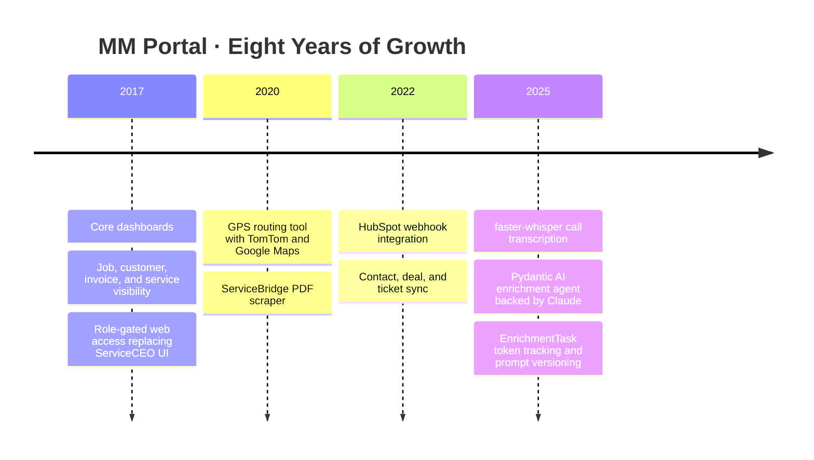
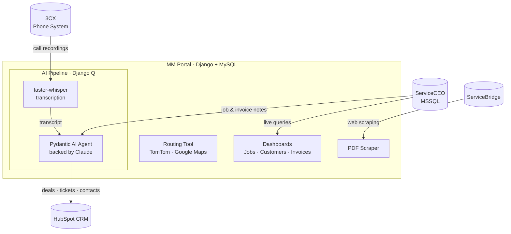
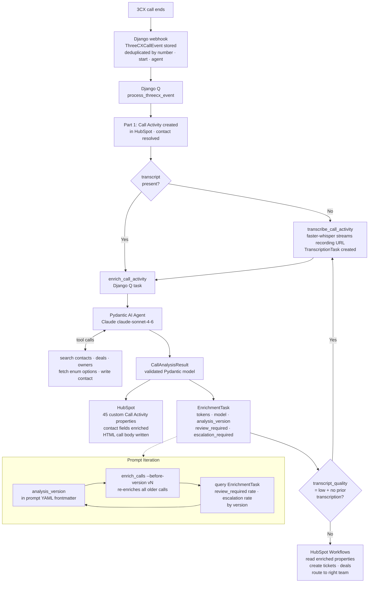
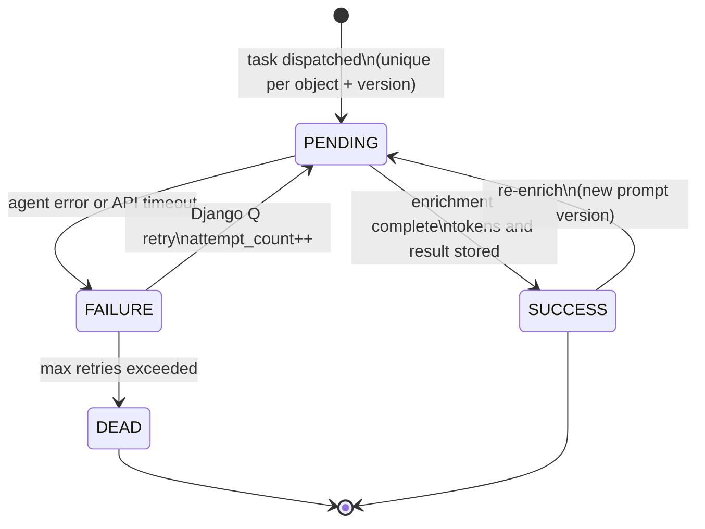

# MM Portal — Project Draft

> Preview file. Approve this, then I'll write to the seed files.
> **Note:** Timeline years for phases 2 and 3 are approximate — adjust if needed.

---

## Name

MM Portal

## Slug

`mm-portal`

## Year

2017

## Company

MMPC

## Repo

`https://github.com/mmpc-nyc/mmportal-django` — private (`is_public: false`)

---

## Summary

Internal Django platform that extends M&M Environmental's aging field service system, giving 50-plus employees fast web access, GPS routing, and an AI pipeline that turns missed call signals and job notes into actionable HubSpot tasks.

---

## Description (Markdown)

MM Portal is the internal web platform I built for M&M Environmental alongside ServiceCEO, a 2007-era field service management desktop application running on SQL Server 2005 that took three to five minutes to load a single page and no longer accepted new user licenses. Rather than replace it, MM Portal extends it: scheduling, sales, accounting, and customer service teams get fast, role-gated web access to the same underlying data without touching ServiceCEO's slow interface. The company has since grown from 30 to over 100 employees.

Core features include job, customer, invoice, and service dashboards backed by a live MSSQL connection to ServiceCEO. The scheduling team uses a TomTom-powered routing tool that maps technician locations, scores route efficiency, and visualizes coverage gaps. A web scraper logs into ServiceBridge, a third-party mobile field app also connected to ServiceCEO, to download work orders, service agreements, and other generated PDFs that are otherwise inaccessible via API.

The AI layer connects 3CX phone calls and ServiceCEO job data to HubSpot: faster-whisper transcribes calls, then a Pydantic AI agent backed by Claude identifies service requests, sales opportunities, and scheduling conflicts and creates deals, tickets, and enriched contact records in HubSpot. A parallel pipeline runs the same extraction over ServiceCEO job and invoice notes. The goal is to catch overlooked signals (unactioned call follow-ups, missed upsell moments, late-caught scheduling conflicts) and put them in front of the right team before the window closes. Built with Django, Python, HTMX, Bootstrap, MySQL, and MSSQL; used daily by over 50 people.

## How It Grew

MM Portal started as one thing and became another. The timeline below shows how each phase added a new layer without replacing what came before.

## Architecture

MM Portal connects five external systems through a single Django application. ServiceCEO (legacy MSSQL) is read directly for dashboards and feeds the AI pipeline via job and invoice notes. 3CX phone events arrive via webhook; ServiceBridge PDFs are pulled by a web scraper. All enriched data flows out to HubSpot.

## AI Call Enrichment Pipeline

Every 3CX call that ends goes through a two-stage async pipeline. Part 1 runs synchronously inside `process_threecx_event`: it creates a HubSpot Call Activity and resolves the contact (via entity_id fast-path, phone search, or sparse contact creation). Part 2 is dispatched independently as a Django Q task, so the call log is in HubSpot before enrichment starts. If a transcript is missing or low-quality, a `transcribe_call_activity` task runs faster-whisper against the recording URL first, then re-queues enrichment.

The enrichment task runs a Pydantic AI agent backed by Claude with five Django-backed tools: contact search, deal lookup, owner resolution, HubSpot enum option fetching, and a fill-if-blank contact write. The agent classifies each call into a domain-specific type hierarchy with confidence thresholds; calls below the threshold are flagged for human review rather than silently misfiled. It produces a validated `CallAnalysisResult` that drives writes to 45 custom HubSpot Call Activity properties and a structured HTML call body. Every attempt is recorded in an `EnrichmentTask` row that tracks token counts, model name, and `analysis_version`. That version string comes from the YAML frontmatter of the system prompt, so when a new prompt ships, `enrich_calls --before-version vN` re-enriches all older calls and the task records make it straightforward to compare review flag rates and escalation rates across versions.

## EnrichmentTask State Machine

The `EnrichmentTask` model tracks every enrichment attempt with bounded retry and a terminal `dead` state. A blank `analysis_version` on a HubSpot Call Activity is the idempotency sentinel: blank means not yet enriched, present means done. The `untranscribable` state handles a specific failure mode: if a second enrichment attempt (after re-transcription with faster-whisper) still classifies the transcript as low quality, Django writes `transcript_quality = untranscribable` directly to the HubSpot Call Activity. That value is visible to operators in HubSpot without any Django access, so they know to listen to the recording manually.

## Key Engineering Decisions

**Part 1 and Part 2 run as separate Django Q tasks.** The call log exists in HubSpot as soon as Part 1 completes. A slow Claude API call or enrichment failure does not hide the call from agents. The `ThreeCXCallEvent` is marked `PROCESSED` after Part 1, not after enrichment — so the status accurately reflects what it means.

**Per-call `WhisperModel` instantiation, not a singleton.** Loading `large-v3` (~5 GB) on each transcription is slow, but holding it resident across workers would exhaust RAM on the current server. The `transcribe_from_url()` interface abstracts the implementation; swapping Whisper for a remote transcription service later is a change inside one file.

**`analysis_version` on HubSpot as the idempotency sentinel.** A blank property means not yet enriched. HubSpot is already the authoritative store for call data, so using a Django-side flag would create a second source of truth and silently hide calls where the write-back to HubSpot failed. The management command queries HubSpot directly with no Django state required.

**`EnrichmentTask` generalized before the second enrichment type existed.** The first design was call-specific. Before any migration was created, the schema was refactored to `(object_type, object_id, analysis_version)` with accumulated token counts across retries. Five enrichment types are planned (calls, emails, deals, contacts, tickets). One row per object means "total spend this month across all types" is a single aggregation query.

---

## Skills

Django, Python, Bootstrap, HTMX, MySQL, MSSQL, Linux, REST, Web Scraping, HubSpot, Pydantic AI

## New Skills to Add to DB

| Name | Icon | Proficiency | Category |
|---|---|---|---|
| HubSpot | `simple-icons:hubspot` | advanced | Other |
| Pydantic AI | `simple-icons:pydantic` | intermediate | Frameworks and Libraries |

---

## Featured Project

**Tagline:** Built on top of a 2007-era field service system, now the operations hub for 50-plus daily users at M&M Environmental, with GPS routing and an AI pipeline connecting calls and job data to HubSpot.

**Display order:** 6
