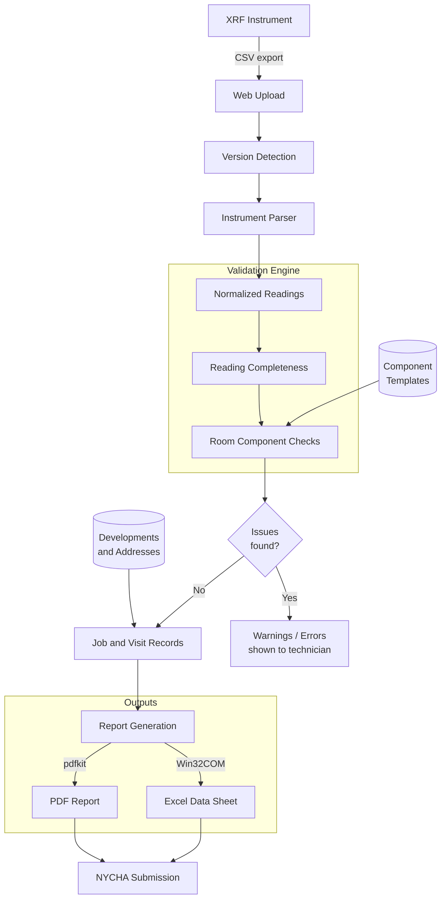

# NYCHA XRF Lead Inspection and Reporting Platform — Project Draft

> Preview file. Approve this, then I'll write to the seed files.

## Name / Slug / Year / Company / Repo

| Field | Value |
|---|---|
| Name | NYCHA XRF Lead Inspection and Reporting Platform |
| Slug | nycha-xrf-lead-inspection-and-reporting-platform |
| Year | 2023 |
| Company | Green Orchard Group *(new — not yet in companies table)* |
| Repo | https://github.com/mmpc-nyc/mmpcWebApps |
| is_public | false |
| image_url | null |

## Summary

A Django platform for managing NYCHA XRF lead inspection workflows, from raw instrument data import through PDF and Excel compliance report generation.

## Description (Markdown)

Green Orchard Group held a $5M NYCHA contract to conduct XRF lead-based paint inspections across New York City public housing. I built the platform that managed the inspection workflow and generated the compliance reports each job required.

NYCHA's reporting requirements are detailed: each inspection produces a 20-30 page PDF compliance report alongside a templated Excel data sheet with embedded formulas. A rejected submission restarts a review cycle that can delay payment by months and may require a full reinspection.

The platform covers the workflow from upload to submission: field technicians upload raw CSV exports from their XRF devices, the system parses the instrument-specific format, validates every reading against NYCHA's component and measurement rules, and flags discrepancies before report generation. Two outputs are produced per job: a PDF compliance report rendered from Django HTML templates via pdfkit, and a formatted Excel data sheet converted via Win32COM to preserve embedded formula integrity. Both are merged into a single submission package.

Report generation went from around three hours per inspection to under three minutes.

## Architecture

XRF instruments export readings as CSV files. Before parsing, the platform detects the instrument firmware version from the file header, since different versions output different column layouts and field encodings. The detected version routes the file to the correct parser, which normalizes readings into a common schema.

Report generation runs two parallel paths: HTML templates rendered by Django feed into pdfkit to produce the PDF compliance report; a separate Excel template is populated and converted to PDF via Win32COM, chosen over a pure-Python library to preserve the integrity of embedded formulas that NYCHA auditors check. Both outputs are merged into a single submission package.

## Validation

Validation is where most of the complexity lives. NYCHA defines component requirements per room type: each room category has an expected set of components that must be inspected, and the platform checks each visit's readings against those templates. Missing or incomplete components surface as warnings or errors before a report can be generated, with enough specificity to tell the technician exactly what to fix.

NYCHA updated these requirements regularly, sometimes monthly. Component templates had to be kept current without invalidating existing records. The same applied to development and address data: NYCHA's property records changed over time, and the platform maintained its own models of developments, buildings, and units, with logic to reconcile incoming data against the current reference.

## Key Engineering Decisions

**Instrument version detection:** Different firmware versions of the same XRF device model output CSV files in subtly different formats — column ordering, field names, and decimal precision all varied. Rather than a single parser that tried to handle all variants, the platform detects the version from the file header and routes accordingly. Adding support for a new firmware version means adding a new parser path, not modifying existing ones.

**Per-instrument CSV parsers:** Each device model also has a fundamentally different CSV structure. Separate parser classes per model keep the logic isolated and make it straightforward to add new devices without touching existing code.

**Paint chip sample overrides:** When an XRF reading falls in the inconclusive range, NYCHA requires a paint chip sample to confirm the result. The platform models this as an override: a paint chip concentration, when present, replaces the XRF reading as the final reported value, mirroring NYCHA's procedural hierarchy and keeping the validation logic auditable.

**Continuous schema evolution:** NYCHA updated its reporting requirements roughly every month or two. The Django migration history reflects this across two years of active use.

## Skills

Django, Python, HTMX, Bootstrap

*(Removing from existing entry: Figma, Digital Ocean, Postgres)*

## New Skills to Add to DB

None.

## New Company to Add to DB

| Field | Value |
|---|---|
| Name | Green Orchard Group |
| URL | null |

## Featured Project

| Field | Value |
|---|---|
| Tagline | Cut NYCHA lead inspection reporting from three hours to three minutes on a $5M contract. |
| Display order | 7 |
