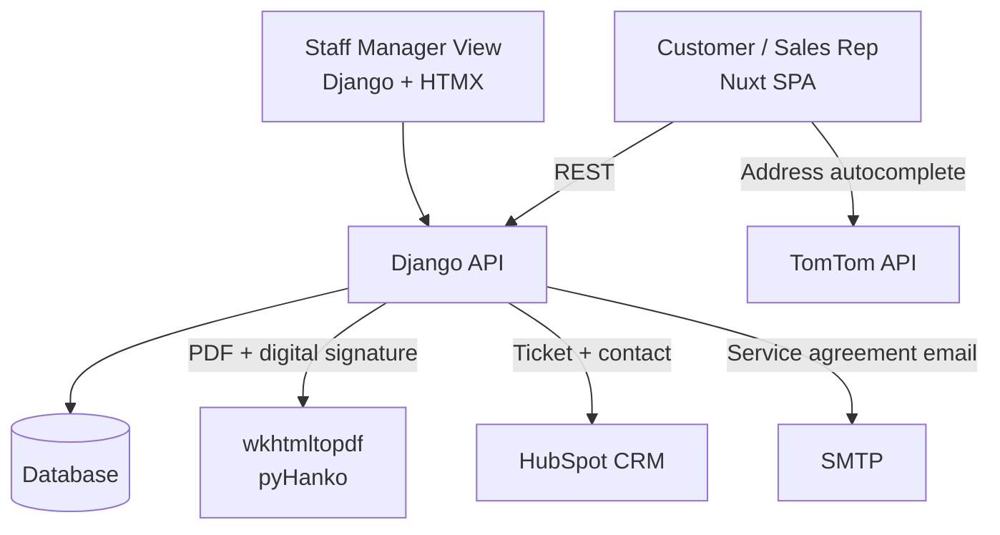
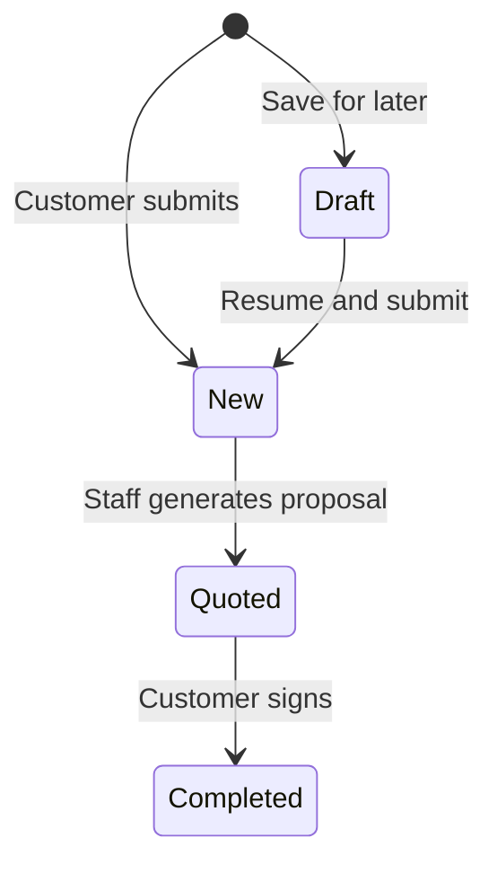

# Recurring Service Quoting Portal — Project Draft

> Preview file. Approve this, then I'll write to the seed files.

## Name / Slug / Year / Company / Repo

- **Name**: Recurring Service Quoting Portal
- **Slug**: recurring-service-quoting-portal
- **Year**: 2024
- **Company**: MMPC
- **Repo**: https://github.com/mmpc-nyc/mmpc-website-apps
- **is_public**: false

---

## Summary

Customer-facing quoting portal for MMPC's recurring pest control programs, automating multi-step intake, real-time pricing, and signed PDF proposal delivery.

---

## Description (Markdown)

MMPC operates two recurring pest control programs for residential and commercial properties across New York City. Getting an accurate quote for either required back-and-forth between sales reps and property managers, and pricing varied by building type, unit count, service method, contract length, and optional add-ons that made manual calculation unreliable.

The portal replaced that back-and-forth. Property managers can fill out a multi-step intake form, receive a real-time price, and get a signed PDF proposal without any sales rep involvement. The same form also serves as a training tool for sales reps, walking them through the conditional questions that determine scope and price for complex jobs.

I worked on the Django backend and the visual design of the frontend. Two other developers on the team built out the Nuxt frontend. The stack runs in Docker, with the statically generated SPA served by Nginx and API calls proxied to Django under Gunicorn.

### Architecture

### Quote Lifecycle

### Key Engineering Decisions

Pricing is calculated server-side through a strategy pattern, one implementation per program type, so the rules live in one place and can be tested in isolation. The frontend sends form data to the API and renders the returned price rather than computing it locally.

Draft save uses a magic link rather than requiring account creation. A customer can save a link to their email and resume the form on any device.

PDF proposals are rendered from Django HTML templates through pdfkit and wkhtmltopdf, then digitally signed with pyHanko. HubSpot contact and ticket records are created on submission so the sales team can track quote status without logging into the portal.

---

## Skills

Django, Python, HTMX, Vue, HubSpot, Docker, Nuxt, Tailwind, Vuetify

---

## New Skills to Add to DB

None.

---

## Featured Project

No.
