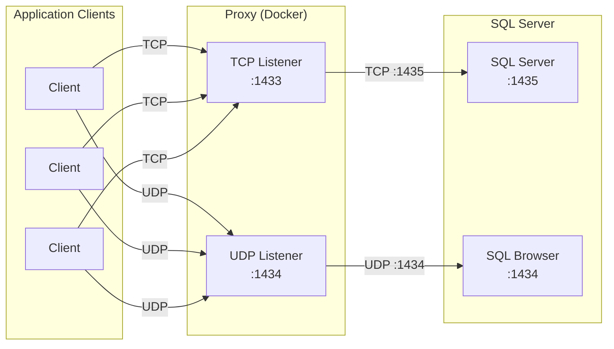
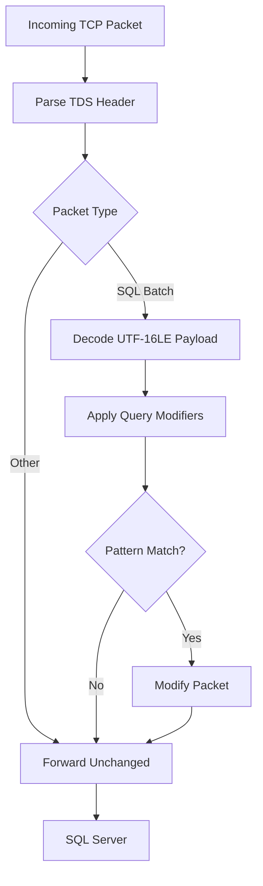

# SQL Server Connection Proxy — Project Draft

> Preview file. Approve this, then I'll run copy-style and write to the seed files.

## Name / Slug / Year / Company / Repo

- **Name:** SQL Server Connection Proxy
- **Slug:** sql-server-connection-proxy
- **Year:** 2024
- **Company:** MMPC
- **Repo:** https://github.com/mmpc-nyc/serviceCEOProxy
- **is_public:** false
- **image_url:** null

## Summary

A transparent TCP/UDP proxy that decodes TDS protocol packets to extend the operational life of a vendor-abandoned platform, running in production since 2024.

## Description (Markdown)

This is one of my favorite projects. Reverse-engineering a proprietary wire protocol to keep vendor-abandoned software running in production required a deep understanding of TDS.

The proxy sits transparently between application clients and a Microsoft SQL Server instance, handling both TCP connections and UDP broadcast discovery queries. On the TCP side, every packet is decoded against the TDS (Tabular Data Stream) specification, the binary protocol SQL Server uses for all client communication, inspected for specific query patterns, and modified before being forwarded upstream. On the UDP side, SQL Browser discovery traffic is forwarded as-is. Clients cannot tell the difference from a direct connection.

### TDS Packet Structure

TDS packets carry an 8-byte fixed header followed by a variable-length payload. Understanding those fields was the key to building the decoder:

| Field | Size | Description |
|---|---|---|
| Type | 1 byte | Packet type: SQL Batch (`0x01`), Pre-Login (`0x02`), RPC Request (`0x03`), Tabular Result (`0x05`) |
| Status | 1 byte | Bitfield flags: EOM (`0x01`), Ignore (`0x02`), Reset Connection (`0x08`) |
| Length | 2 bytes | Total packet length, header included |
| SPID | 2 bytes | Session process ID; ties the packet to a specific client session |
| Packet ID | 1 byte | Sequence number for multi-packet messages |
| Window | 1 byte | Reserved |

SQL Batch payloads, the packet type that carries raw SQL queries, are encoded as UTF-16-LE. Decoding them is straightforward once you know the type field; working out what to intercept and why required understanding the full exchange.

Deployed as multiple Docker containers on a Linux host with a custom ipvlan network, the service handles the full connection lifecycle. I developed both synchronous (ThreadPoolExecutor) and async (asyncio) variants, which turned into its own exploration of how Python handles concurrent I/O at the network layer. The Docker side of things, container networking, running multiple instances, and isolating traffic, was as much of a learning thread as the protocol work. Structured logging with log rotation covers production observability. The proxy has been running in production since 2024.

## Architecture

## TDS Packet Pipeline

## Skills

- Python
- Docker
- MSSQL

## New Skills to Add to DB

None — all skills already exist.

## Featured Project

No.
